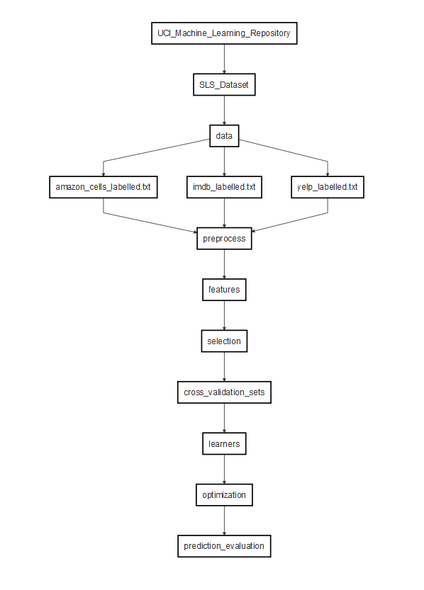

---
references:
- id: lichman2013
  title: (UCI) Machine Learning Repository
  author:
  - family: Lichman
    given: Moshe
  URL: "http://archive.ics.uci.edu/ml"
  note: "Accessed: 2017-04-11"
  issued:
    year: 2013
  institution: "University of California, Irvine, School of Information and Computer Sciences"
- id: sigkdd2016
  title: KDD Cup Archives
  author: 
  - family: SIGKDD
    given: ""
  URL: "www.kdd.org/kdd-cup"
  note: "Accessed: 2017-04-11"
  issued:
    year: 2013
- id: kotzias2015
  title: "From Group to Individual Labels Using Deep Features"
  container-title: "Proceedings of the 21th ACM SIGKDD International Conference on Knowledge Discovery and Data Mining"
  author:
  - family: Kotzias
    given: Dimitrios
  - family: Denil
    given: Misha
  - family: Nando
    given: "De Freitas"
  - family: Smyth
    given: Padhraic
  URL: "http://dl.acm.org/citation.cfm?id=2783380"
  DOI: "10.1145/2783258.2783380"
  page: 597-606
  type: article-journal
  publisher: Association for Computing Machinery
  issued:
    year: 2015
- id: prakash2011
  title: "Natural language processing: an introduction"
  container-title: "Journal of the American Medical Informatics Association"
  author:
  - family: Nadkarni
    given: Prakash M
  - family: Ohno-Machado
    given: Lucila
  - family: Chapman
    given: Wendy W
  DOI: "10.1136/amiajnl-2011-000464"
  page: 544-551
  type: article-journal
  publisher: PubMed Central
  issued:
    year: 2011
  volume: 18
  issue: 5
- id: borra2010
  title: "Measuring the prediction error. A comparison of cross-validation, bootstrap and covariance penalty methods"
  container-title: "Computational Statistics and Data Analysis"
  author:
  - family: Borra
    given: Simone
  - family: Di Ciaccio
    given: Agostino
  DOI: "10.1016/j.csda.2010.03.004"
  page: 2876-2989
  type: article-journal
  publisher: Elsevier
  issued:
    year: 2010
  volume: 54
  issue: 12
- id: breiman2001
  title: "Random Forests"
  container-title: "Machine Learning"
  author:
  - family: Breiman
    given: Leo
  DOI: "10.1023/A:1010933404324"
  page: 5-32
  type: article-journal
  publisher: Springer
  issued:
    year: 2001
  volume: 45
  issue: 1
- id: selivanov2016
  title: "text2vec: Modern Text Mining Framework for R"
  author:
  - family: Selivanov
    given: Dmitriy
  URL: "https://cran.r-project.org/package=text2vec"
  issued:
    year: 2016
- id: kuhn2016
  title: "caret: Classification and Regression Training"
  container-title: "Journal of Statistical Software"
  author:
  - family: Kuhn
    given: Max
  type: article-journal
  URL: "https://CRAN.R-project.org/package=caret"
  page: 1-5
  issued:
    year: 2016
  volume: 28
  issue: 5
- id: meyer2017
  title: "e1071: Misc Functions of the Department of Statistics, Probability Theory Group (Formerly: E1071), TU Wien"
  author:
  - family: Meyer
    given: David
  URL: "https://cran.r-project.org/package=e1071"
  issued:
    year: 2017
---

```{r setup, include = FALSE}

# (package_install) Required packages
packages <- c("text2vec", "caret", "e1071", "randomForest")
for (pkg in packages) {
  if (!requireNamespace(pkg, quietly=TRUE)) {
    install.packages(pkg,
                     dependencies=TRUE,
                     repos="http://cran.rstudio.com/")
  }
}

# (chunk_options) KnitR chunk options
knitr::opts_chunk$set(
  echo = FALSE,
  message = FALSE,
  warning = FALSE,
  results = "asis"
)

```

\newpage

# Objectives

This assignment was provided by Dr. Cherie Ding for the CP8305 Knowledge Discovery course at Ryerson University. The purposes of the assignment was to:  

1. Identify a practical dataset from the University of California, Irvine (UCI) Machine Learning Repository [@lichman2013] or Knowledge Discovery in Databases (KDD) Cup Archives [@sigkdd2016]  
2. Identify a machine learning problem with the chosen dataset in (1)  
3. Apply various machine learning algorithms to the problem in (2) to find algorithms that can solve (2) well and provide insight into the data in (1)

# Data

```{r raw, include=FALSE}

# 1. Download the zipped SLS data from UCI into a temp dir
temp <- tempdir()
src <- paste0("http://archive.ics.uci.edu/ml/machine-learning-databases/",
              "00331/sentiment%20labelled%20sentences.zip")
zipped <- file.path(temp, basename(src))
download.file(src, zipped)
unzip(zipped, exdir=temp)

# 2. Obtain SLS data paths from unzipped folder
slsFolder <- file.path(temp, "sentiment labelled sentences")
slsIgnore <- file.path(slsFolder, c(".DS_Store", "readme.txt"))
slsFiles <- list.files(slsFolder, full.names=TRUE)
slsFiles <- slsFiles[!slsFiles %in% slsIgnore]

# 3. Obtain raw data
raw <- list()
for (p in slsFiles) {
  raw[[basename(p)]] <- readLines(p)
}
rawInstances <- sum(sapply(raw, length))
rawFiles <- paste0(names(raw), collapse=", ")
rawPrevRows <- 5

```

The data chosen for this assignment was the Sentiment Labelled Sentences (SLS) Dataset donated on May 30, 2015 and downloaded from the UCI Machine Learning Repository [@kotzias2015]. There are `r length(raw)` text files (`r rawFiles`) with a combined total of `r rawInstances` instances, absent of missing values. Each file consists of 2 attributes with the first attribute being sentences from (string type) and the second being a binary class of either 0 for negative sentiment or 1 for positive sentiment (numeric type). The data in each file had attributes separated by a mixture of inconsistent spaces and tabs, and instances separated by rows. An example of the first `r rawPrevRows` rows are shown in Table \@ref(tab:tab1)^[In the table, (tab) indicates that a tab character was present in the data sample.]. Sentences were extracted by @kotzias2015 from [imdb.com](www.imdb.com), [amazon.com](www.amazon.com), and [yelp.com](www.yelp.com). These websites represent a movie database, online retailer, and a online business directory with crowd-sourced reviews, respectively. The SLS files are summarized in Table \@ref(tab:tab2)^[For clarification, a double indicates type numeric and a character indicates type string.].

```{r tab1}
knitr::kable(
  data.frame(
    Line = 1:rawPrevRows,
    Sample = gsub("\t", " (tab) ", raw[[1]][1:rawPrevRows]),
    stringsAsFactors = FALSE
  ),
  row.names = FALSE,
  col.names = c("Line", "Sample"),
  caption = paste("SLS Dataset Example for", strsplit(names(raw)[[1]], "_")[[1]][1], "Data")
)
```

```{r tab2}
knitr::kable(
  data.frame(
    File = names(raw),
    Instances = sapply(raw, length),
    Attributes = 2
  ),
  row.names = FALSE,
  col.names = c("File", "Instances", "Attributes"),
  caption = 'SLS Dataset Summary'
)
```

# Problem

The goal of the SLS dataset was to predict the values in attribute 2 (sentiment) which contain 0 or 1 for negative and positive sentiment respectively. The binary values of attribute 2 defined the SLS dataset as a classification problem. In order to predict sentiment, sentences from three different websites ([imdb.com](www.imdb.com), [amazon.com](www.amazon.com), and [yelp.com](www.yelp.com)) were given as the explanatory attribute 1. The text values of attribute 1 further defined the problem as a Natural Language Processing (NLP)^[NLP seeks to extract meaning from textual data involving language communication with low level tasks such as identification of individual words and high level tasks such as spelling correction [@prakash2011]] problem where the attribute values were unstructured, and required pre-processing before the machine could read and learn to model the SLS data. For simplicity, attribute 1 was referred to as the sentence attribute and attribute 2 was referred to as the sentiment attribute. The problem was then known as a classification problem for the sentiment attribute that required NLP of the sentence attribute. The following sections more formally define the problem framework.

## Sentiment Attribute

The sentiment attribute was the second attribute in the SLS dataset. It is the target vector $y^{(n)}$ containing binary values of either 0 or 1 given $n$ instances as seen in Equation \@ref(eq:eq1):

\begin{equation}
  y^{(n)} \in \{0, 1 \}
(\#eq:eq1)
\end{equation}

## Sentence Attribute

The sentence attribute was the first attribute in the SLS dataset. It is the raw text data $x^{(n)}$ given $n$ instances such that it contains $k$ number of words $w^{(k, n)}$ (separated by spaces^[For example, the text instance "hello goodbye now", contain 3 words "hello", "goodbye", and "now" that are separated by spaces]), where the word lengths^[Word lengths and text lengths are measured in the number of characters, excluding spaces and symbols that define punctuation, which are more specifically the number of alphanumeric characters in this case (e.g. the word "apple" has a length of 5 alphanumeric characters and the text "!*--" has a length of 0 characters containing non-alphanumeric characters)] $l_w$ of $w^{(k, n)}$ and $k$ are less than the length $l_x$ of the raw texts $x^{(n)}$ as seen in Equation \@ref(eq:eq2):

\begin{equation}
  w^{(k, n)} \in x^{(n)} \mid \enspace 0 < l_w^{(k)} \leq l_x^{(n)} \enspace and \enspace 0 < k \leq l_x^{(n)} 
(\#eq:eq2)
\end{equation}

## Measures of Prediction Quality

The classification problem given $x^{(n)}$ as the explanatory data and $y^{(n)}$ as the target classes was to obtain measurement values that define an algorithm to predict $y^{(n)}$ well. Predicted classes $y_{pred}^{(n)}$ are obtained using $x^{(n)}$ training features seen in Equation \@ref(eq:eq3): 

\begin{equation}
  y_{pred}^{(n)} = f(x^{(n)})
(\#eq:eq3)
\end{equation}

The classification prediction quality used measurements that were based on the $f_{eq}$ counts of $y_{pred}^{(n)}$ that were equal to $y^{(n)}$ given the total number of instances $N$ expressed in Equation \@ref(eq:eq4):

\begin{equation}
  f_{eq} = \sum_{n=1}^N y_{eq} \mid
  y_{eq} =
  \begin{cases}
    1: & \text{if}\ y_{pred}^{(n)} = y^{(n)} \\
    0: & \text{otherwise}
  \end{cases}
(\#eq:eq4)
\end{equation}

Accuracy measurements were defined as a maximization problem, where higher values are better and lower values are worse. Error measurements were defined as a minimization problem, where lower values are better and higher values are worse.  

An accuracy measurement $f_{acc}$, where $C_{acc}$ is a constant representing the best prediction quality, increases the more times $y_{pred}^{(n)}$ is equal to $y^{(n)}$ given $f_{eq}$ as seen in Equation \@ref(eq:eq5): 

\begin{equation}
  \lim_{f_{acc} \to C_{acc}} f_{acc} \enspace as \enspace f_{eq} \rightarrow \infty \enspace \mid f_{acc} = f(y_{pred}^{(n)}, y^{(n)})
(\#eq:eq5)
\end{equation}

An error measurement $f_{err}$, where $C_{err}$ is a constant representing the worse prediction quality, decreases the more times $y_{pred}^{(n)}$ is equal to $y^{(n)}$ given $f_{eq}$ as seen in Equation \@ref(eq:eq6):

\begin{equation}
  \lim_{f_{err} \to C_{err}} f_{acc} \enspace as \enspace f_{eq} \rightarrow \infty \enspace \mid f_{err} = f(y_{pred}^{(n)}, y^{(n)})
(\#eq:eq6)
\end{equation}

# Methods

The methods described in this section attempted to experiment with several solutions to the classification problem defined in Section [3][Problem]. The unstructured nature of the sentence attribute presented required preprocessing to create features which are then further processed to search for adequately useful features (selection). These features were then randomly split into approximately equal number of instances for cross validation training sets. These training sets were then used as input for a selected number of algorithms and evaluated for prediction quality. A summary of the methods is shown in Figure \@ref(fig:fig1). See Appendix [A][Appendix A: R Code] for the R code.

```{r fig1, fig.cap="Flowchart of Methods"}

```

## Preprocessing

The preprocessing steps involved getting the data ready for the machine learning algorithms to train on. This involved creating features from the instances in the sentence attribute and selecting only the features that are measured to be useful in terms of predicting the target sentiment attribute. Furthermore, the data was also split into cross validation training sets and used as the resulting training data for the machine learning algorithms.

### Parsing

The data was defined as a tab delimited text file that held string based text as the first sentence attribute and numeric binary numbers as the second sentiment attribute. The unstructured nature of the sentence attribute made parsing the file less straight-forward as instances in the sentence attribute were not quoted and could contain any number of tab characters. The data was: 

1. Parsed line by line
2. Cleaned by removing the last occurence of tab characters and punctuation
3. Extracted for sentiment and sentence instances where the last character was defined as the sentiment, and the rest of the text was defined as the sentence

```{r parsing}

# 1. Read the data on a line by line basis
sls <- sapply(slsFiles, readLines)

# 2. Extract sentence and sentiment attributes
x <- c() # sentence attribute
y <- c() # sentiment attribute
for (n in sls) { # each instance n
  lx <- nchar(n) # sentence length
  xn <- substr(n, 1, lx - 2) # sentence instance
  xn <- gsub('[[:punct:] ]+',' ', xn) # remove punctuation
  yn <- as.numeric(substr(n, lx - 1, lx)) # sentiment instance
  x <- c(x, xn)
  y <- c(y, yn)
}
ds <- data.frame(sentence=x, sentiment=y, stringsAsFactors=FALSE)

```

### Features

The features^[Features in this report are similar to attributes, except that features refer to the machine-constructed columns to differ from the original sentence and sentiment attributes] were created using a simple bag of words model. The bag of words model constructs a feature for each unique word in the sentence attribute and counts the occurrence per sentence instance in the SLS dataset [@prakash2011]. Each $k$ word feature $w^{(k)}$ is a count of the occurrence of $k$ unique words in the sentence attribute $x^{(n)}$ given $n$ instances.  For clarification, all words were considered, including stop words^[Stop words are commonly used words in the language that are often, but not always, removed as they may not hold useful information, but there is a possibility that stop words may be useful], as these would be removed in the feature selection process if they were measured as being not very useful - thus, the possibility of them being useful was considered. An example of word features is given in Table \@ref(tab:tab3). Feature construction was applied using the *text2vec* R package [@selivanov2016].

```{r tab3}
knitr::kable(
  data.frame(
    word1 = c(2, 5, 10),
    word2 = c(5, 2, 10),
    wordk = c(10, 5, 2)
  ),
  row.names = FALSE,
  col.names = c("Word-1", "Word-2", "Word-k"),
  caption = "Example of Word Features"
)
```

```{r features, cache=TRUE}

library(text2vec)

# 0. Variables
xn <- ds$sentence

# 1. Obtain words wn for each xn using a tokenizer
wn <- itoken(xn, tolower, word_tokenizer)

# 2. Vocabulary of wk words for wn 
wk <- vocab_vectorizer(create_vocabulary(wn))

# 3. Obtain word features matrix wnk given n instances and k words
wnk <- as.matrix(get_dtm(create_corpus(wn, wk)))
rawFeatureCols <- ncol(wnk)

```

## Algorithms

The algorithms applied to solve the classification problem involved optimizing features and a measure of prediction quality based on training and testing on cross validation folds.

### Feature Selection

Feature selection was used to filter the word features $w^{(k)}$ for the most important word features. A measure of importance was defined by using the Random Forest (RF) algorithm. The RF algorithm ensembles multiple decision trees by randomly subsetting portions of the complete data to construct each tree [@breiman2001]. For each portion of data subsetted, there were remaining portions that were used to calculate an Out Of Bag (OOB) error by using the constructed decison trees to predict on the remaining data portions. These remaining portions were referred to as the OOB samples, and were used in calculating the feature importances. Each $k$ word feature $w^{(k)}$ was then calculated for feature importances by randomly permuting prediction errors on the OOB samples, and comparing their differences on the permuted and un-permuted errors. These feature importances quantify the usefulness of word features for the classification problem, where higher values represent more useful features and lower values represent less useful features. Initially, features in which the occurrence of the word is less than 0.1% of the total number of occurrences were removed, followed by strict removal of features that were slightly to highly correlated, where features with correlation values of greater than 0.05 were removed. This enabled independence assumptions to be better satisfied as there were an abundance of features. The feature selection then filtered for the top 10 features with the highest feature importance based on a random forest classifier with 500 trees. The feature selection algorithm was applied using the *caret* package [@kuhn2016].

```{r selection, cache=TRUE}

library(caret)
library(randomForest)

# 0. Variables
yn <- as.factor(ds$sentiment)

# 1. Keep only words that occur more than 0.1% of occurences
freqc <- apply(wnk, 2, sum)
wnk <- wnk[, which(freqc > sum(freqc) * 0.001)]

# 2. Remove highly correlated features over 0.05
wcor <- findCorrelation(cor(wnk), cutoff = 0.05)
wnk <- wnk[, -wcor]

# 4. Calculate RF feature importances and select top 10
rfFit <- randomForest(
  x=wnk,
  y=yn,
  importance=TRUE,
  proximity=TRUE,
  ntree=500
)
impw <- importance(rfFit)[, 4]
impw <- impw[order(-impw)]
wnk <- wnk[, names(impw)[1:10]]

```

### Cross Validation

The data from the feature selection was split into a standard 10-fold cross validation scenario. In the 10-fold cross validation scenario, the data was randomly split into 10 equal parts, trained on 9 parts, and tested on the 1 part not in the 9 training parts until all testing parts have been tested for [@borra2010]. Cross validation enabled prediction quality measures to evaluate the generalization of algorithms as different parts of the data were used to learn from and predict on. This generalization quality more accurately represented real-world scenarios as there are often missing portions of data, and a complete dataset is often not available as data is continuously updated. Cross validation was also applied using the *caret* R package.

```{r cv}

# Each element are the row ids of a 10 fold CV
cv <- caret::createFolds(1:nrow(wnk),
                         k = 10,
                         list = TRUE,
                         returnTrain = TRUE)

```

### Selected Learners

The learners selected for the experiments were standard machine learning choices that were relatively efficient and simple to run as the strict correlation removal procedure and feature selection process enabled relatively independent features of low dimensionality. The selected machine learning algorithms are the Naive Bayes Classifier (NBC), Support Vector Machine (SVM) and Random Forest (RF) from the R package *e1071* [@meyer2017]. The selected algorithms were evaluated based on their F1 score to account for potential binary class imbalances in the sentiment attribute. See the learners section under Appendix [A][Appendix A: R Code] for more details.

```{r learners, cache=TRUE}
library(e1071)

# 1. Set algorithms dependencies
precision <- caret::precision
recall <- caret::recall

# 2. Results list to collect Predictions
results <- list(
  svm = c(),
  rf = c(),
  nbc = c()
)

# 3. Predict on 10 fold CV
for (ids in cv) {
  
  # 3.1 Training data
  xtrain <- wnk[ids, ]
  ytrain <- yn[ids]
  
  # 3.2 Testing data
  xtest <- wnk[-ids, ]
  ytest <- yn[-ids]
  
  # 3.3 Create models
  nbcModel <- naiveBayes(x=wnk, y=yn, laplace=1)
  svmModel <- svm(x=xtrain, y=ytrain, kernel = "linear")
  rfModel <- randomForest(x=xtrain, y=ytrain, ntrees = 500)
  
  # 3.3 Predictions
  nbcPredict <- predict(nbcModel, xtest)
  svmPredict <- predict(svmModel, xtest)
  rfPredict <- predict(rfModel, xtest)
  
  # 3.4 Evaluate Precision
  nbcPrecision <- precision(nbcPredict, ytest)
  svmPrecision <- precision(svmPredict, ytest)
  rfPrecision <- precision(rfPredict, ytest)
  
  # 3.5 Evaluate Recall
  nbcRecall <- recall(nbcPredict, ytest)
  svmRecall <- recall(svmPredict, ytest)
  rfRecall <- recall(rfPredict, ytest)
  
  # 3.6 Evaluate F1 Score
  nbcF1 <- (2 * nbcPrecision * nbcRecall) / (nbcPrecision + nbcRecall)
  svmF1 <- (2 * svmPrecision * svmRecall) / (svmPrecision + svmRecall)
  rfF1 <- (2 * rfPrecision * rfRecall) / (rfPrecision + rfRecall)
  
  # 3.7 Add to results
  results$nbc <- c(results$nbc, nbcF1)
  results$svm <- c(results$svm, svmF1)
  results$rf <- c(results$rf, rfF1)
}

# 4. Aggregate results
resultMeans <- c(
  mean(results$svm),
  mean(results$rf),
  mean(results$nbc)
)
resultsCombined <- c(results$svm, results$rf, results$nbc)

```

# Results

Figure \@ref(fig:fig2) shows the distribution of classes in the sentiment attribute. The results ranged from CV F1 scores of `r round(min(resultsCombined), 2)` to `r round(max(resultsCombined), 2)` per fold. Figure \@ref(fig:fig3) shows the average CV F1 scores obtained from the experiments. The word feature importances are also shown in Figure \@ref(fig:fig4). The top ten word features based on feature importances was selected from these options, which produced a training feature matrix of 10 columns (reduced from `r rawFeatureCols`) by `r rawInstances` rows, with each $k$ column representing $w^{k}$ word vectors.

```{r fig2, fig.cap="Sentiment Class Distribution"}
barplot(
  c(sum(ds$sentiment), rawInstances - sum(ds$sentiment)),
  names.arg=c("Positive(0)", "Negative (1)"),
  xlab="Sentiment", ylab="Frequency"
)
```

```{r fig3, fig.cap="Average F1 Scores"}
barplot(resultMeans, names.arg=c("SVM", "RF", "NBC"), xlab="Learner", ylab="Average F1 Score")
```

```{r fig4, fig.cap="Feature Importances"}
barplot(impw, names.arg=names(impw), ylab="Feature Importance", las=2)
```

\newpage

# Discussion and Conclusion

Both the RF and SVM algorithms performed similarly, while the NBC algorithm performed better of the three selected algorithms. However, the random forest was useful in calculating feature importances used in the feature selection process to reduce the number of dimensions on the data, as well as quantify how much more important one word feature was compared to another word feature. In particular, the word features *love, nice, works, no,* and *worst* were very useful in classifying the sentiment attribute consisting of 0 or 1s indicating negative and positive respectively. Although, the RF and SVM performed rather poorly, the results were reasonable given the large reduction in features and minimal hyperparameter tuning. This is done in exchange for interpretability of results to see what influences positive and negative sentiment without manually reviewing thousands of online reactions, or having advanced knowledge of specific machine learning algorithms. The high dimensionality of the data after processing for the bag of words model made it difficult to obtain quick and efficient methods of feature reduction, however the abundance of features made it more flexible when arbitrary rules were imposed - such as the strict correlation values imposed in the feature selection process. This led to better features for the NBC algorithm, which resulted in the highest average CV F1 score without heavy hyperparameter tuning compared to the RF and SVM. The NBC was a simple, yet efficient and effective algorithm, when features were selected to meet its assumptions of feature independence. Algorithms that can efficiently either utilize high dimensional data or reduce dimensionality with minimal information loss, but still enable the results to be interpreted would be very desirable in machine learning problems involving text based attributes that can be converted into a bag of words model.

\newpage

# References

<div id="refs"></div>

\newpage

# Appendix A: R Code
  
**A0. Dependencies**  
  
The following R code installs required package dependencies if not installed and loads them into the R environment.

```{r appendix-a0, eval=FALSE, echo=TRUE}

# Dependencies ----

# (package_install) Required packages and loading
packages <- c(
  "randomForest",
  "text2vec",
  "caret",
  "e1071"
)
for (pkg in packages) {
  if (!requireNamespace(pkg, quietly=TRUE)) {
    install.packages(pkg,
                     dependencies=TRUE,
                     repos="http://cran.rstudio.com/")
  }
  library(pkg, character.only=TRUE)
}

```

\newpage

**A1. Data**  
  
The SLS dataset is downloaded as a .zip file into a temporary directory, unzipped, and collected for file path information stored as variable **slsFiles**. See [Data] section.

```{r appendix-a1, eval=FALSE, echo=TRUE}

# Data ----

# 1. Download the zipped SLS data from UCI into a temp dir
temp <- tempdir()
src <- paste0("http://archive.ics.uci.edu/ml/machine-learning-databases/",
              "00331/sentiment%20labelled%20sentences.zip")
zipped <- file.path(temp, basename(src))
download.file(src, zipped)
unzip(zipped, exdir=temp)

# 2. Obtain SLS data paths from unzipped folder
slsFolder <- file.path(temp, "sentiment labelled sentences")
slsIgnore <- file.path(slsFolder, c(".DS_Store", "readme.txt"))
slsFiles <- list.files(slsFolder, full.names=TRUE)
slsFiles <- slsFiles[!slsFiles %in% slsIgnore]

```

*SLS Dataset Files*

```{r appendix-a1a}
knitr::kable(
  data.frame(
    file=basename(slsFiles),
    bytes=file.size(slsFiles)
  ),
  col.names = c("Files", "Bytes")
)
```

\newpage

**A2. Parsing**  
  
Parsing is done to read the SLS data, given by the file path information **slsFiles** of the previous code, into a R dataframe named **ds** with columns sentence and sentiment, where each row represents the instances. The sentence column contains the explanatory text data and the sentiment column contains the binary data of 0s and 1s. See [Parsing] section.

```{r appendix-a2, eval=FALSE, echo=TRUE}

# Parsing ----

# 1. Read the data on a line by line basis
sls <- sapply(slsFiles, readLines)

# 2. Extract sentence and sentiment attributes
x <- c() # sentence attribute
y <- c() # sentiment attribute
for (n in sls) { # each instance n
  lx <- nchar(n) # sentence length
  xn <- substr(n, 1, lx - 2) # sentence instance
  xn <- gsub('[[:punct:] ]+',' ', xn) # remove punctuation
  yn <- as.numeric(substr(n, lx - 1, lx)) # sentiment instance
  x <- c(x, xn)
  y <- c(y, yn)
}
ds <- data.frame(sentence = x, sentiment = y, stringsAsFactors=FALSE)

```

\newpage

*Example of Parsed Dataframe*

```{r appendix-a2a}
knitr::kable(
  ds[1:5, ]
)
```

\newpage

**A3. Features**  
  
Features are then constructed using the `?text2vec` word tokenizer to create a bag of words model. This creates variable **wnk** as a matrix where each column are the unique words in all sentence columns of the **ds** data, and each row represents the counts of the words for an instance. See [Features] section.

```{r appendix-a3, eval=FALSE, echo=TRUE}

# Features ----

# 0. Variables
xn <- ds$sentence

# 1. Obtain words wn for each xn using a tokenizer
wn <- itoken(xn, tolower, word_tokenizer)

# 2. Vocabulary of wk words for wn 
wk <- vocab_vectorizer(create_vocabulary(wn))

# 3. Obtain word features matrix wnk given n instances and k words
wnk <- as.matrix(get_dtm(create_corpus(wn, wk)))

```

*Example of bag of words matrix*

```{r appendix-a3a}
knitr::kable(
  wnk[1:5, 1:5]
)
```

\newpage

**A4. Selection**  
  
Feature selection was then done to reduce the dimensionality of the **wnk** bag of words matrix into the most useful features for learning. **wnk** then has features removed in which:

1. Words occurence is less than 0.1% of the total occurences
2. Correlation value `?caret:findCorrelation` with another feature is over 0.05
3. Random Forest variable importance measure `?randomForest::importance` is not in the top 10 highest values

See [Feature Selection] section.

```{r appendix-a4, eval=FALSE, echo=TRUE}

# Selection ----

# 0. Variables
yn <- as.factor(ds$sentiment)

# 1. Keep only words that occur more than 0.1% of occurences
freqc <- apply(wnk, 2, sum)
wnk <- wnk[, which(freqc > sum(freqc) * 0.001)]

# 2. Remove highly correlated features over 0.05
wcor <- findCorrelation(cor(wnk), cutoff = 0.05)
wnk <- wnk[, -wcor]

# 4. Calculate RF feature importances and select top 10
rfFit <- randomForest(
  x = wnk,
  y = yn,
  importance = TRUE,
  proximity = TRUE,
  ntree = 500
)
impw <- importance(rfFit)[, 4]
impw <- impw[order(-impw)]
wnk <- wnk[, names(impw)[1:10]]

```

*Plot of the Feature Importances*

```{r appendix-a4a, echo=TRUE}
barplot(impw, names.arg = names(impw), ylab = "Feature Importance", las=2)
```

\newpage

**A5. Cross Validation**  
  
The row indices of the **wnk* bag of words matrix is then divided into 10 equal parts using `?caret::createFolds` to use as training and testing data for cross validation performance measures. See [Cross Validation] section.

```{r appendix-a5, eval=FALSE, echo=TRUE}

# Cross Validation ----

# Each element are the row ids of a 10 fold CV
cv <- createFolds(1:nrow(wnk),
                  k = 10,
                  list = TRUE,
                  returnTrain = TRUE)
```

**A6. Learners**  

Learners were constructed using `?e1071::naiveBayes`, `?e1071::svm`, and `?randomForest::randomForest`. These were trained on 9 folds of the feature selected *wnk* bag of words matrix, and tested on the 1 remaining fold. This is done until all folds have been tested for. During the testing of each fold, `?caret::precision` and `?caret::recall` is used to calculate the F1 score and stored in a **results** variable. This **results** variable holds the F1 scores for each fold for each algorithm *$nbc*, *$rf* and *$svm*. See [Selected Learners] section.

\newpage

```{r appendix-a6, eval=FALSE, echo=TRUE}

# Learners ----

# 1. Set performance measures
precision <- caret::precision
recall <- caret::recall

# 2. Results list to collect Predictions
results <- list(
  svm = c(),
  rf = c(),
  nbc = c()
)

# 3. Predict on 10 fold CV
for (ids in cv) {
  
  # 3.1 Training data
  xtrain <- wnk[ids, ]
  ytrain <- yn[ids]
  
  # 3.2 Testing data
  xtest <- wnk[-ids, ]
  ytest <- yn[-ids]
  
  # 3.3 Create models
  nbcModel <- naiveBayes(x = wnk, y = yn, laplace = 1)
  svmModel <- svm(x = xtrain, y = ytrain, kernel = "linear")
  rfModel <- randomForest(x = xtrain, y = ytrain, ntrees = 500)
  
  # 3.3 Predictions
  nbcPredict <- predict(nbcModel, xtest)
  svmPredict <- predict(svmModel, xtest)
  rfPredict <- predict(rfModel, xtest)
  
  # 3.4 Evaluate Precision
  nbcPrecision <- precision(nbcPredict, ytest)
  svmPrecision <- precision(svmPredict, ytest)
  rfPrecision <- precision(rfPredict, ytest)
  
  # 3.5 Evaluate Recall
  nbcRecall <- recall(nbcPredict, ytest)
  svmRecall <- recall(svmPredict, ytest)
  rfRecall <- recall(rfPredict, ytest)
  
  # 3.6 Evaluate F1 Score
  nbcF1 <- (2 * nbcPrecision * nbcRecall) / (nbcPrecision + nbcRecall)
  svmF1 <- (2 * svmPrecision * svmRecall) / (svmPrecision + svmRecall)
  rfF1 <- (2 * rfPrecision * rfRecall) / (rfPrecision + rfRecall)
  
  # 3.7 Add F1 score of fold to results
  results$nbc <- c(results$nbc, nbcF1)
  results$svm <- c(results$svm, svmF1)
  results$rf <- c(results$rf, rfF1)
}
```

\newpage

*Plot of the Naive Bayes Classifier Results*

```{r appendix-a6a, echo=TRUE}
plot(results$nbc, type = 'l', ylab = "F1 Score", xlab = "CV Fold")
```

\newpage

*Plot of the Random Forest Results*

```{r appendix-a6b, echo=TRUE}
plot(results$rf, type = 'l', ylab = "F1 Score", xlab = "CV Fold")
```

\newpage

*Plot of the Support Vector Machine Results*

```{r appendix-a6c, echo=TRUE}
plot(results$svm, type = 'l', ylab = "F1 Score", xlab = "CV Fold")
```
